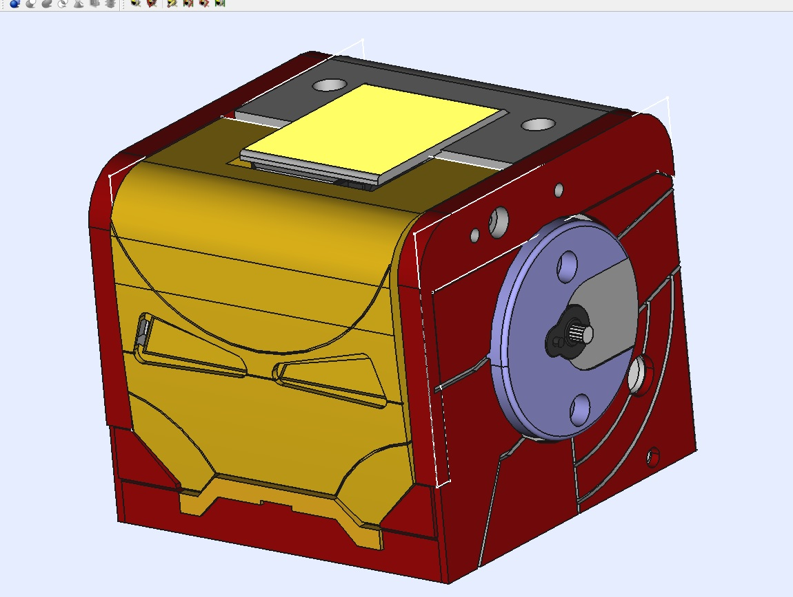

<table>
<tr>
<td>
</td>
</tr>
</table>

# Iron Zowi 

A Zowi robot mod inspired on Ironman suite

<td>

</td>

## BOM
TODO

## Files
**CAD FOLDER**  Freecad source files

**STL FOLDER**  STL files ready to print

## Contributing
1. Fork it!
2. Create your feature branch: `git checkout -b my-new-feature`
3. Commit your changes: `git commit -am 'Add some feature'`
4. Push to the branch: `git push origin my-new-feature`
5. Submit a pull request :D

## Credits

Designed by Gianluca Pugliese [Owensource](https://www.owensource.com) 

Sponsored by BQ untill March 2016

Inspired on the awesome ZOWI MicroRider mod

- [Zowi](https://github.com/bqlabs/zowi)
- [Javier Isabel](https://github.com/JavierIH)

## License

This robot is licensed under a [Creative Commons Attribution-ShareAlike 4.0 International License](http://creativecommons.org/licenses/by-sa/4.0/). Please read the LICENSE files for more details.

Este robot tiene una licencia [Creative Commons Attribution-ShareAlike 4.0 International License](http://creativecommons.org/licenses/by-sa/4.0/). Por favor, lea los ficheros LICENSE para más detalles
